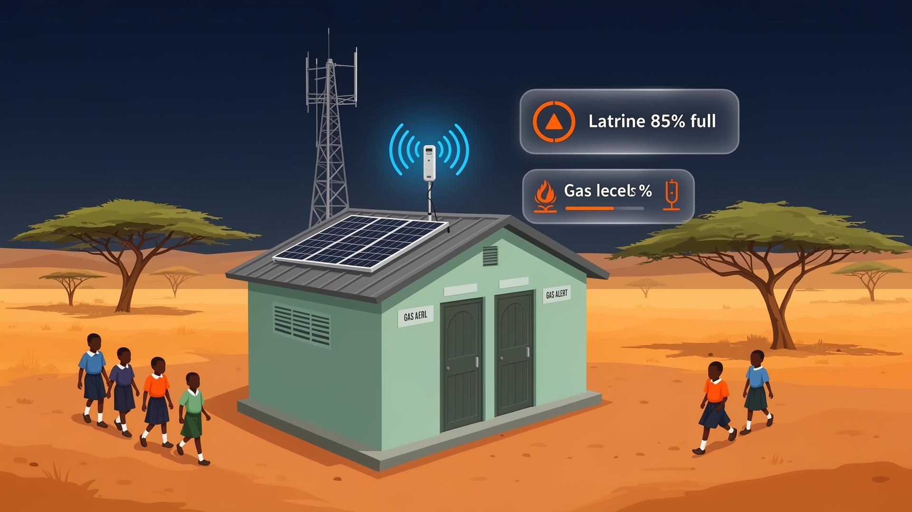

# Sani Alert Ghana 🚰

**Climate-Resilient Sanitation Monitoring System**

An IoT-powered early warning system that prevents pit latrine overflow and dangerous gas buildup in schools and communities across Northern Ghana.



## 🌍 Mission

Sani Alert Ghana addresses critical sanitation challenges in Northern Ghana by providing real-time monitoring and early warning systems for pit latrines. Our solution prevents health hazards, protects water sources, and ensures safe sanitation facilities for schools and communities.

## ✨ Features

- **🔔 Real-time SMS Alerts**: Instant notifications when waste levels reach critical thresholds
- **📊 Live Dashboard**: Web-based monitoring interface with real-time data visualization
- **☀️ Solar-Powered IoT Sensors**: Sustainable, off-grid monitoring devices
- **📱 Mobile-First Design**: Responsive interface accessible on all devices
- **🌡️ Multi-Parameter Monitoring**: Tracks waste levels, gas concentrations, and environmental conditions
- **🎯 SDG Impact Tracking**: Monitors progress toward UN Sustainable Development Goals

## 🛠️ Technology Stack

- **Frontend**: React 19 with TanStack Start (SSR)
- **Routing**: TanStack Router (file-based routing)
- **Styling**: Tailwind CSS v4 with custom design system
- **UI Components**: Radix UI primitives with custom components
- **Charts**: Recharts for data visualization
- **Forms**: React Hook Form with Zod validation
- **Build Tool**: Vite
- **Package Manager**: npm
- **Deployment**: Static site generation ready

## 🚀 Quick Start

### Prerequisites

- Node.js 18+ 
- npm 8+

### Installation

1. **Clone the repository**
   ```bash
   git clone https://github.com/abdulhakim1217/sani-safe-ghana.git
   cd sani-safe-ghana
   ```

2. **Install dependencies**
   ```bash
   npm install
   ```

3. **Start development server**
   ```bash
   npm run dev
   ```

4. **Open your browser**
   Navigate to `http://localhost:3000`

### Available Scripts

- `npm run dev` - Start development server
- `npm run build` - Build for production
- `npm run preview` - Preview production build
- `npm run lint` - Run ESLint
- `npm run format` - Format code with Prettier

## 📁 Project Structure

```
sani-safe-ghana/
├── src/
│   ├── components/
│   │   ├── site/          # Main site components
│   │   └── ui/            # Reusable UI components
│   ├── routes/            # File-based routing
│   │   ├── __root.tsx     # Root layout
│   │   ├── index.tsx      # Homepage
│   │   └── dashboard.tsx  # Live dashboard
│   ├── lib/               # Utilities and configurations
│   ├── hooks/             # Custom React hooks
│   ├── assets/            # Images and static files
│   └── styles.css         # Global styles
├── package.json
├── vite.config.ts         # Vite configuration
├── tailwind.config.js     # Tailwind CSS configuration
└── tsconfig.json          # TypeScript configuration
```

## 🎨 Design System

The project uses a custom design system built on Tailwind CSS:

- **Colors**: Custom color palette optimized for accessibility
- **Typography**: Sora (display) and Manrope (body) font families
- **Components**: Consistent spacing, shadows, and border radius
- **Dark Mode**: Full dark mode support
- **Responsive**: Mobile-first responsive design

## 🌐 Deployment

### Static Site Generation

```bash
npm run build
```

The built files will be in the `dist/` directory, ready for deployment to any static hosting service.

### Recommended Hosting Platforms

- **Vercel**: Zero-config deployment with GitHub integration
- **Netlify**: Continuous deployment with form handling
- **GitHub Pages**: Free hosting for open source projects
- **Cloudflare Pages**: Fast global CDN with edge computing

## 🤝 Contributing

We welcome contributions to improve Sani Alert Ghana! Here's how you can help:

1. **Fork the repository**
2. **Create a feature branch**
   ```bash
   git checkout -b feature/amazing-feature
   ```
3. **Make your changes**
4. **Commit your changes**
   ```bash
   git commit -m "Add amazing feature"
   ```
5. **Push to your branch**
   ```bash
   git push origin feature/amazing-feature
   ```
6. **Open a Pull Request**

### Development Guidelines

- Follow the existing code style
- Write meaningful commit messages
- Add tests for new features
- Update documentation as needed
- Ensure accessibility compliance

## 📊 Impact & SDG Alignment

Sani Alert Ghana directly contributes to multiple UN Sustainable Development Goals:

- **SDG 3**: Good Health and Well-being
- **SDG 6**: Clean Water and Sanitation
- **SDG 11**: Sustainable Cities and Communities
- **SDG 13**: Climate Action

## 🏆 Recognition

- Featured in climate resilience initiatives
- Supported by local government partnerships
- Community-driven development approach

## 📞 Contact & Support

- **Website**: [Sani Alert Ghana](https://sani-alert-ghana.vercel.app)
- **Email**: contact@sanialert.gh
- **GitHub**: [@abdulhakim1217](https://github.com/abdulhakim1217)

## 📄 License

This project is licensed under the MIT License - see the [LICENSE](LICENSE) file for details.

## 🙏 Acknowledgments

- Northern Ghana communities for their invaluable feedback
- Local schools participating in pilot programs
- Climate resilience research partners
- Open source community for amazing tools and libraries

---

**Built with ❤️ for Ghana's sustainable future**

*Preventing sanitation disasters before they happen — smart, solar-powered IoT monitoring for schools and communities.*